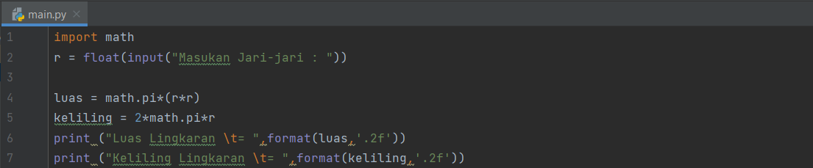
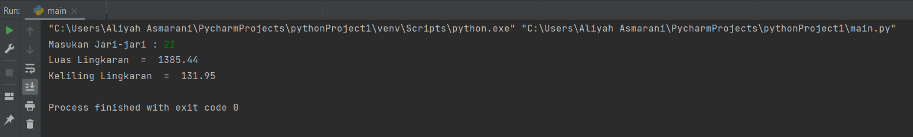

# praktikum3

## MENGHITUNG LUAS & KELILING LINGKARAN PADA PYTHON

## PROGRAM PYTHON MENGHITUNG LUAS & KELILING LINGKARAN

# Source Code
Berikut ini adalah Code Program untuk Menghitung Luas Lingkaran dan Keliling Lingkaran dalam bahasa pemrograman Python:

```
import math
r = float(input("Masukan Jari-jari : "))

luas = math.pi*(r*r)
keliling = 2*math.pi*r

print ("Luas Lingkaran \t= ",format(luas,'.2f'))
print ("Keliling Lingkaran \t= ",format(keliling,'.2f'))
```


# Output (Hasil Running Program)
Berikut ini adalah hasil running program untuk menghitung luas Lingkaran dan Keliling Lingkaran dalam bahasa pemrograman Python:



## FLOWCHART MENGHITUNG LUAS & KELILING LINGKARAN


Penjelasan Algoritma Menghitung Luas dan Keliling Lingkaran sebagai berikut:
1. Mulai
2. Masukan Jari-Jari
3. Proses hitung Luas (L) dan Keliling (K) Lingkaran
4. Tampilkan Luas (L) dan Keliling (K) Lingkaran
5. Selesai


